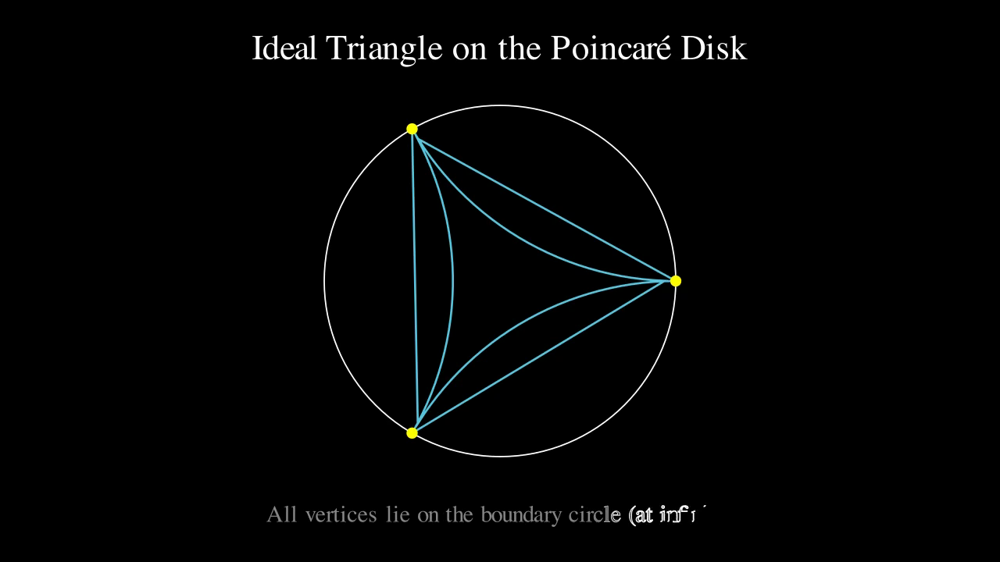
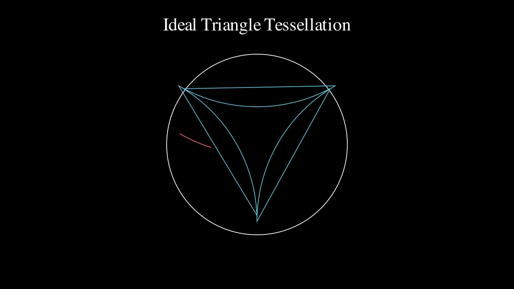
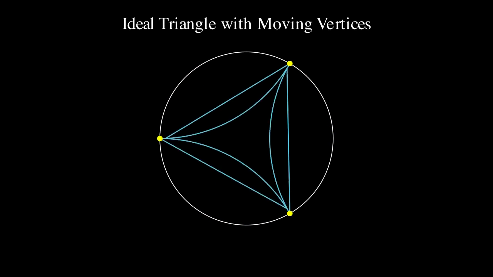
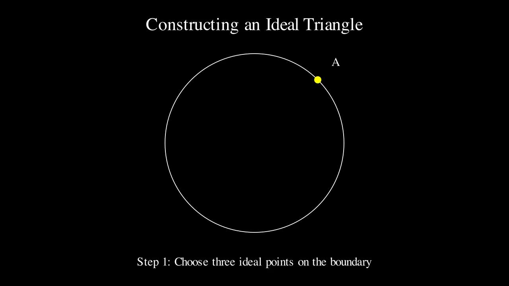

# Ideal Triangles on the Poincare Disk

Manim animations demonstrating ideal triangles in the Poincare disk model of hyperbolic geometry.

## What are Ideal Triangles?

In hyperbolic geometry, an **ideal triangle** is a triangle where all three vertices lie on the boundary circle "at infinity." Despite having vertices at infinity, ideal triangles have **finite area**.

The sides of the triangle are hyperbolic geodesics, which in the Poincare disk model are:
- Circular arcs orthogonal to the boundary circle, or
- Diameters (when vertices are antipodal)

### Area Calculation

In hyperbolic geometry with Gaussian curvature K = -1, the area of a triangle is given by the **Gauss-Bonnet theorem**:

```
Area = π - (α + β + γ)
```

where α, β, γ are the interior angles. For an ideal triangle, all vertices are at infinity, so all angles are 0:

```
Area = π - (0 + 0 + 0) = π
```

**All ideal triangles have the same area: π (approximately 3.14159).**

This is a remarkable property: regardless of how the ideal triangle is positioned or shaped in the disk, its hyperbolic area is always exactly π.

## Scenes

### 1. Ideal Triangle Scene
A single ideal triangle with vertices equally spaced at 120 degrees on the boundary.



```bash
manim -qm ideal_triangles.py IdealTriangleScene
```

### 2. Multiple Ideal Triangles
Multiple ideal triangles tessellating the Poincare disk, each with area π.



```bash
manim -qm ideal_triangles.py MultipleIdealTriangles
```

### 3. Animated Ideal Triangle
An ideal triangle with vertices rotating around the boundary circle. The shape changes but the area remains constant at π.



```bash
manim -qm ideal_triangles.py AnimatedIdealTriangle
```

### 4. Ideal Triangle Construction
Step-by-step construction showing how geodesics (circular arcs perpendicular to the boundary) connect ideal points.



```bash
manim -qm ideal_triangles.py IdealTriangleConstruction
```

## Requirements

- Python 3.8+
- Manim Community Edition

```bash
pip install manim
```

## Usage

Render all scenes at medium quality:
```bash
manim -qm ideal_triangles.py IdealTriangleScene
manim -qm ideal_triangles.py MultipleIdealTriangles
manim -qm ideal_triangles.py AnimatedIdealTriangle
manim -qm ideal_triangles.py IdealTriangleConstruction
```

For high quality output, use `-qh` instead of `-qm`.

## Output

Videos are saved to `media/videos/ideal_triangles/720p30/`

## Mathematical Background

The Poincare disk model represents hyperbolic geometry within the unit disk. Key properties:

| Property | Description |
|----------|-------------|
| **Geodesics** | Circular arcs perpendicular to the boundary (or diameters) |
| **Ideal points** | Points on the boundary circle represent "points at infinity" |
| **Conformal** | The model preserves angles |
| **Distance** | Hyperbolic distance → ∞ as points approach the boundary |
| **Ideal triangle area** | Always exactly π (finite!) |

### Why Finite Area?

In Euclidean geometry, a triangle with vertices at infinity would have infinite area. But hyperbolic geometry has negative curvature, which causes geodesics to diverge. This "extra space" near the boundary means that even though ideal points are infinitely far away, the enclosed region has finite hyperbolic area.
